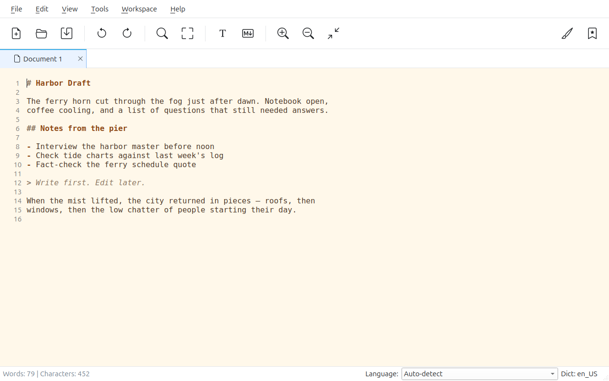

# Jottr

A plain text and Markdown editor for writers, journalists, and researchers.

## What makes it different

- **Simple, minimal interface** — a clean writing space without clutter
- **Editor color themes** — including a paper-like Sepia theme
- **Site-specific search** — select text and search it from the context menu in an integrated browser. Add your favorite sites; each one becomes a custom Google search scoped to that site.
- **Focus Mode** — a clean writing column with menus and toolbars hidden
- **Snippets & Tab completion** — save reusable text blocks and insert them as you type
- **Markdown preview** — write and render side by side

## Install

[Flathub](https://flathub.org/apps/io.github.mfat.jottr) · [Releases](https://github.com/mfat/jottr/releases) (Linux, macOS, Windows)

macOS needs Enchant: `brew install enchant`

GPL-3.0
